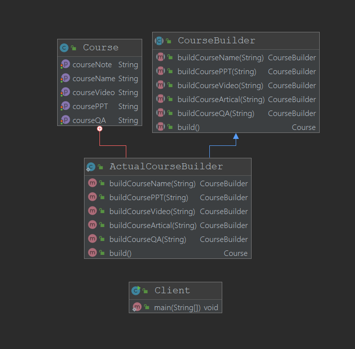

# 建造者模式

## 定义
+ 将复杂对象的创建过程独立出来，同样的构建过程可以创建不同的表示
+ 用户只需要一步一步的去指定锁需要建造的类型就可以得到他们，建造的过程和细节可以忽略
## 适用场景

+ 复杂创建过程适用

## 优点
+ 封装性好，创建和使用分离
+ 建造类独立，在一定程度上解耦
## 缺点
+ 产生多余的Builder对象
+ 产品内部发生变化，修改的成本比较大

## 类图



## 其他

+ 类似C++中的cin与cout不停使用流操作符来进行调用

## 在源码中的体现

+ `SpringBuild`类的`build`方法,`StringBuffer`也是，并且加入了同步操作

+ Guava中的集合类的build方法
```java
Set<String> set = ImmutableSet.<String>builder().add("a").add("b").build();
```
+ Guava中的Cache的类
+ Spring的`BeanDefinitionBuilder`
+ MyBatis的`SqlSessionFactoryBuilder`


