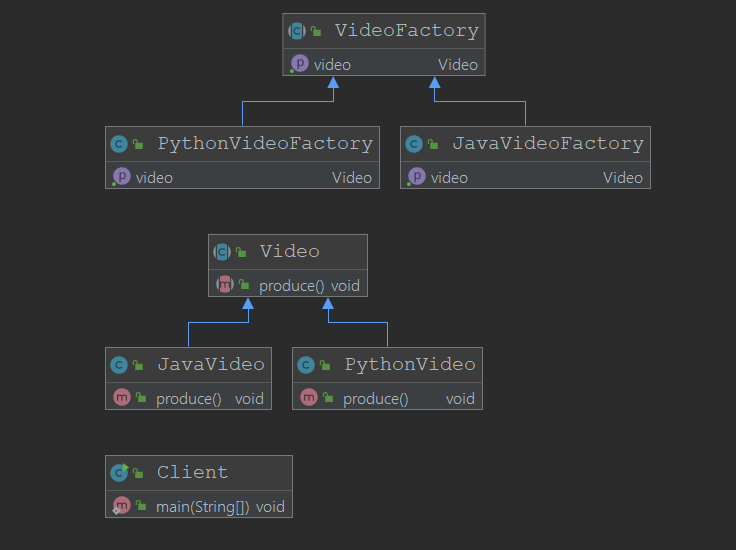

# 工厂方法模式

工厂是工厂属性，方法是抽象方法

工厂方法是对工厂做了抽象，工厂都能生产产品，但是工厂的类型不一样,工厂方法模式对工厂生产的产品做了细分


## 定义

+ 定义一个创建对象的接口（工厂属性在接口中指明）
+ 让接口的实现类来决定如何实例化类（工厂的实现类）
+ 工厂方法让类的实例化推迟到子类中进行(使得工厂的实现类更容易扩展)

## 使用场景

当工厂的类型可以不同时，例如在Spring中ApplicationContext可以是有通过XML方式读取Bean的，有通过ClassPath读取Bean的，甚至是可以直接通过代码配置的

## 类图



## 优点

+ 用户只需要关心所需产品对应的工厂（注意,这里用户需要关系的内容比简单工厂更多），无需关心创建的细节
+ 加入新的产品符合开闭原则，提交可扩展性

## 缺点

+ 类的个数过多，增加复杂度
+ 增加了系统的抽象性和理解难度

## 在源码中的体现

+ JDK中Collection中有`Iterator<E> iterator`接口方法,Collection接口相当于工厂的抽象定义，而每个Collection实现类都有对应该方法的实现类，相当于具体的工厂，而这些工厂类生产的商品都实现了`Iterator`的接口，相当与这个例子实例当中的Video接口

+ JDK中的接口`URLStreamHandlerFactory`
```java
public interface URLStreamHandlerFactory {
    URLStreamHandler createURLStreamHandler(String protocol);
}
private static class Factory implements URLStreamHandlerFactory {
    private static String PREFIX = "sun.net.www.protocol";

    private Factory() {
    }

    public URLStreamHandler createURLStreamHandler(String var1) {
        String var2 = PREFIX + "." + var1 + ".Handler";

        try {
            //使用反射创建
            Class var3 = Class.forName(var2);
            return (URLStreamHandler)var3.newInstance();
        } catch (ReflectiveOperationException var4) {
            throw new InternalError("could not load " + var1 + "system protocol handler", var4);
        }
    }
}
```