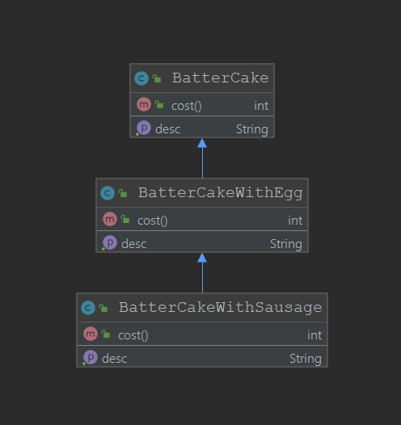
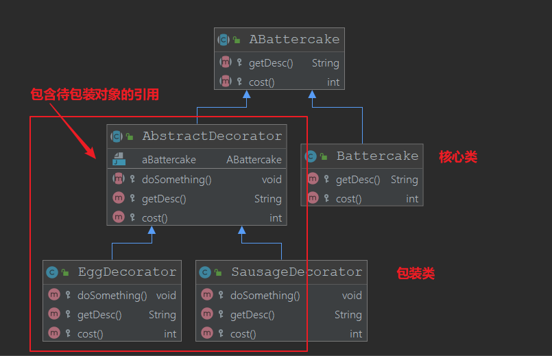

# 装饰者模式
## 定义
+ 在不改变原有对象的基础之上，将功能附加到对象上
+ 提供了比基础更有弹性的替代方案（按需扩展原有对象的功能）
## 适用场景
+ 扩展一个类的功能或者给一个类添加附加的职责
+ 动态的给一个对象添加功能，这些功能可以动态的撤销
## 优点
+ 继承的有力补充，比继承灵活，不盖面原有对象的情况下给一个对象扩展功能
+ 通过使用不同的装饰类以及这些装饰类的排列组合，可以实现不同效果
+ 符合开闭原则，分清楚哪些时核心业务，哪些是装饰功能来增强核心功能的。
## 缺点
+ 会出现更多的代码，更多的类，增加模块的复杂性
## 装饰器模式的设计演进
引入一个简单的场景，买煎饼的情况，可以加鸡蛋，加香肠，都是煎饼简单的继承一下，需要的时候创建，就可以实现这个需求，类图如下

但是如果我们需要一个加两个鸡蛋的煎饼，这样的设计只能再扩展类，这是不合适的，改进之后的类图如下

一个核心类在被一层一层包装之后调用方法颇有方法链的感觉，当然装饰类可以扩展一些方法
## 相关的设计模式
+ 代理模式

代理模式关注控制对象的访问,隐藏了被代理的对象，而装饰者模式被装饰的类是作为参数传入的 

+ 适配器模式

他们都属于Wrapper，都起到了包装的作用
## 在源码中的体现
+ IO包例如`BufferReader`,通过传入核心类`Reader`构造，很多类似的例子
+ MyBatis中的Cache与`LRUCache`,`FIFOCache`等等
