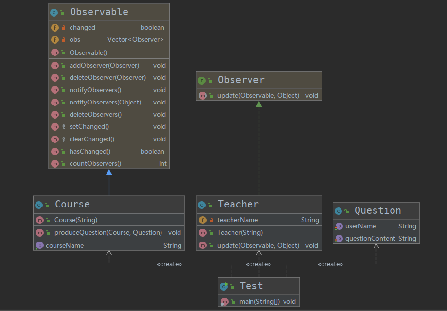

# 观察者模式
## 定义
定义了对象之间的一对多依赖，让多个观察者对象同事监听某一个主题对象，当主题对象发生变化的时候，他的所有的依赖者（观察者）都会收到通知并更新
+ 类似微信朋友圈点赞，点赞的人在动态更新之后都会收到消息

## 优点
+ 观察者和被观察者之间建立一个抽象的耦合
+ 观察者模式支持广播同学，类似群聊
## 缺点

+ 观察者之间有过多的细节依赖
+ 使用要得到当，要避免循环调用

## 代码案例解释
首先JDK自带了一系列类来完成对观察者的支持
+ `Observer` 观察者
+ `Obserable` 被观察者

+ 被观察者维护了一个数据结构来保存对其改变感兴趣的观察者的信息，通过`getChange()`以及`notifyObservers`来传递信息
+ 具体代码请在同级目录下查找

## UML 类图

## 在源代码中的体现
+ Java `Event`类
+ Spring 以及Servlet等等类似监听器的内容`Listener`
+ GuavaEvent
```java
//定义监听器
public class GuavaEvent {
    @Subscribe
    public void subscribe(String str){
        System.out.println("执行了Subscribe方法，传入的参数是："+str);
    }
}
//使用总线来维护观察者
public class GuavaEventTest {
    public static void main(String[] args) {
        EventBus eventBus = new EventBus();
        GuavaEvent event = new GuavaEvent();
        eventBus.register(event);
        eventBus.post("post的内容");
    }
}
```
## 注意
+ 类似发布-订阅者模式