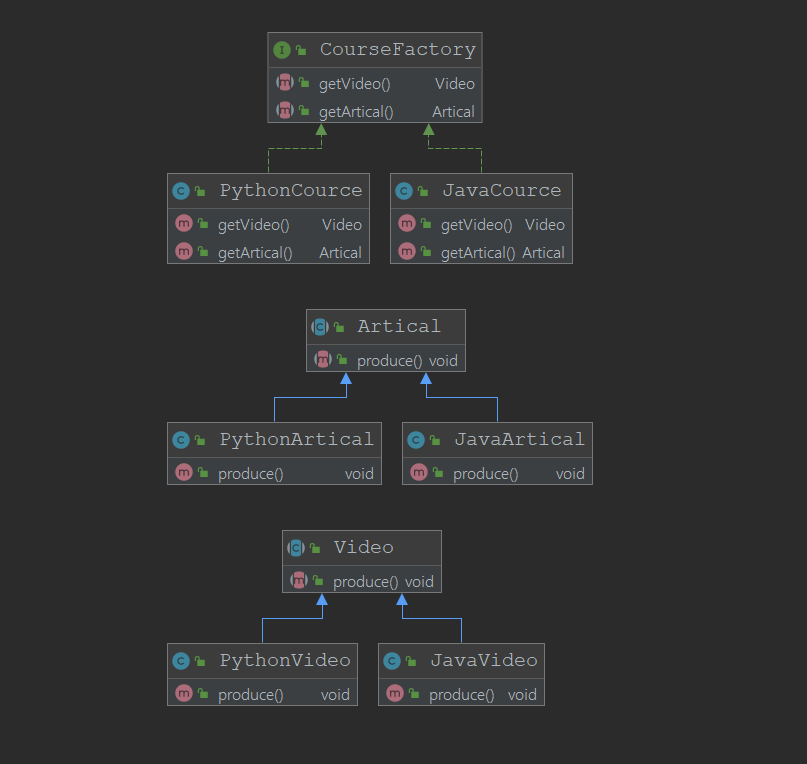

# 抽象工厂

当一个工厂可以生产不只一类东西的时候，这个时候我们可以使用抽象工厂

## 定义

+ 抽象工厂模式提供了一个创建一系列相关或者相互依赖的对象的接口

+ 无需指定具体的工厂类

## 理解产品与产品族

工厂可以生产Video,可以生产NoteBook,但是匹配的Video与NoteBook配套才称之为一种Course,video和note这是两种不同的类型但是同一类工厂生产的，这些被称之为“产品族”而一中产品族对于着不同的产品


## 适用场景

+ 客户端（应用层）

## 优点
+ 具体产品在应用层代码隔离，无需关心创建细节

+ 将一个系列的产品族一起创建

## 缺点

+ 规定了所有可能被创建的产品集合，产品族中扩展新的产品困难，需要修改抽象工厂的接口
+ 增加了系统的抽象程度以及理解难度

## 类图


## 在源码中的体现
+ Java中SQL包中的Connection类中可以通过`createStatement()`创建一个`Statement`，或者创建`PreparedStatement`这个Connection类对象相当于一个抽象工厂的接口定义，而接口`Statement`和`PreparedStatement`相当于一个工厂所生产的不同类型，而MySQL驱动所产生的Connection这个抽象工厂可以生产一系列的同一“产品族”的商品。
```java
public interface Connection  extends Wrapper, AutoCloseable {

    Statement createStatement() throws SQLException;


    PreparedStatement prepareStatement(String sql)
        throws SQLException;


    CallableStatement prepareCall(String sql) throws SQLException;
    //...
}

public interface Statement extends Wrapper, AutoCloseable{
    //....
}
//PreparedStatement ...

```
+ MyBatis的`SqlSessionFactory`

