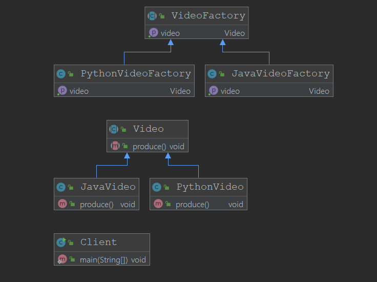

# 工厂方法模式

工厂是工厂属性，方法是抽象方法

工厂方法是对工厂做了抽象，工厂都能生产产品，但是工厂的类型不一样,工厂方法模式对工厂生产的产品做了细分

## 定义

+ 定义一个创建对象的接口（工厂属性在接口中指明）
+ 让接口的实现类来决定如何实例化类（工厂的实现类）
+ 工厂方法让类的实例化推迟到子类中进行(使得工厂的实现类更容易扩展)

## 使用场景

当工厂的类型可以不同时，例如在Spring中ApplicationContext可以是有通过XML方式读取Bean的，有通过ClassPath读取Bean的，甚至是可以直接通过代码配置的

## 类图

## 优点

+ 用户只需要关心所需产品对应的工厂（注意,这里用户需要关系的内容比简单工厂更多），无需关心创建的细节
+ 加入新的产品符合开闭原则，提交可扩展性

## 缺点

+ 类的个数过多，增加复杂度
+ 增加了系统的抽象性和理解难度
