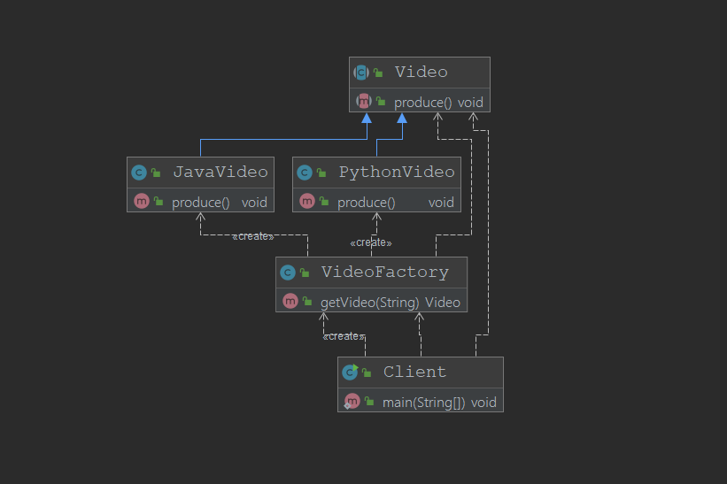

# 简单工厂模式

不属于GOF 23种设计模式

## 优点

+ 只需要传入一个正确的参数，就可以获取想要的对象，而无需知道创建的细节
+ 客户端免除创建对象实例的过程，无需知道具体的细节
+ 实现了对责任的分割

## 缺点
+ 工厂类的职责太重
+ 增加新的产品，需要修改工厂的判断逻辑，违背开闭原则

## 实现

## 扩展

+ 简单工厂的创建对象可以通过反射传入Class对象或者是全类名在一定程度上满足开闭原则
## JDK源码中使用简单工厂的案例

+ `Calendar`类创建方法
+ JDBC 中`Class.forname()`方法数据库驱动执行静态方法将自己注册到`DriverManager`
