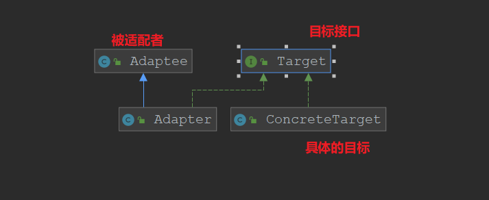
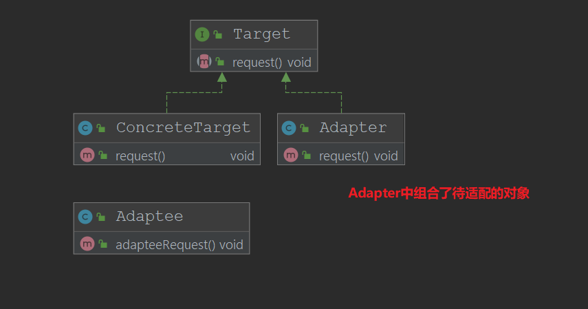

# 适配器模式
将一个类的接口转换为客户期望的另外一个接口,使得原本不兼容的类也可以一起工作
## 使用场景
+ 已经存在的类，当他的方法和需求不匹配的时候（接口符合）但是方法和功能整体相同
## 优点
+ 能够提供类的透明性，可能会增加系统的复杂性
+ 降低代码可读性
## 扩展
+ 对象适配器(组合方式)
+ 类适配器(继承方式)
## 类图
+ 类适配器

+ 对象适配器

## 在源码中的体现
+ Spring AOP 中`AdvisorAdapter`每一个Adapter最终都需要返回一个`MethodInterceptor`对象
+ Spring MVC 中的`HandlerAdapter`是一个Interface,`DispatcherServlet`的`doDispatch()`
方法中通过`getHandler()`获得Handler对象来处请求，而HandlerAdapter就是将
Servlet，Controller等不同的实体适配成handler进行统一操作的，
同时维护一个HandlerAdapter的List,结合每一个`HandlerAdapter`类中的`support()`方法，来找到Controller等对应的适配器类。
