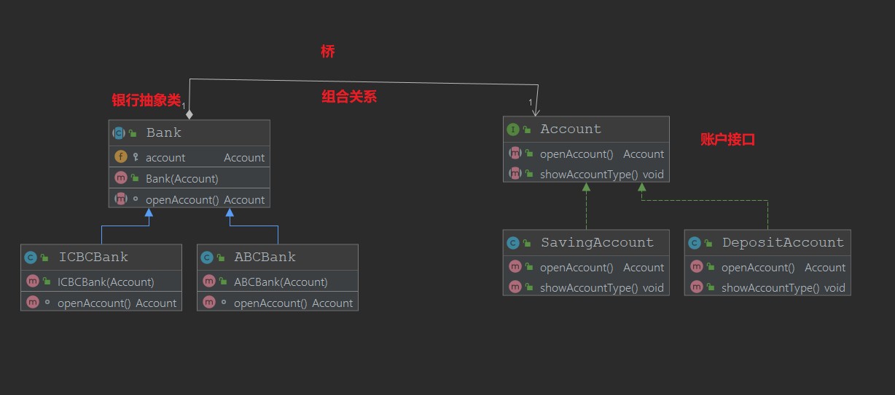

# 桥接模式
## 定义
+ 将抽象的部分与它具体的实现部分分离
+ 通过组合的方式建立两个类之间的联系，而不是通过继承
## 适用场景
+ 在抽象和具体实现之间增加更多的灵活性（对实现的自定义的组合）
+ 一个类存在两个（或者多个）独立变化的维度，并且这几个维度都需要进行独立的扩展
+ 不希望使用继承，或者因为多层继承导致系统中类爆炸
## 优点
+ 分离抽象部分以及具体实现的部分
+ 提高系统的课扩展性
+ 符合开闭原则
## 缺点
+ 增加了系统的理解，以及设计的难度
+ 需要正确地识别出系统所谓多个变化的维度
## 与其他设计模式的区别
+ 桥接模式和组合模式
    + 组合是不同层级的组合
+ 桥接模式与适配器模式
    + 相同点：都是配合工作
    + 桥接强调不同的类合作
    + 适配器强调适配
## 代码模拟的场景
代码模拟了这样的场景,对于银行这个业务来说,首先有不同的银行,而银行的业务对于不同的银行账户而言，分为活期的以及定期的,如果有n个不同的银行对应n个不同的业务，每种业务有n个不同的实现，显然如果
采用一股脑的写下去就会出现类爆炸的情况，最好的方法就是能够将课相似的业务自由组合。

注意在这个例子中
+ 银行业务内有许多子业务（组合）
+ 子业务有多种实现，实现要做到可以替换（接口的使用）
+ 有许多银行都有通用的业务流程（抽象类）

## 在源代码中的体现
+ JDBC规范中定义了Driver,定义了Connection,而Driver可以通过一系列方法返回Connection等等,JDBC的Driver交给子类去实现，而各大数据库厂商负责返回自己对应实现的Connection，严格的讲，与实例中的桥接模式有些出入

    