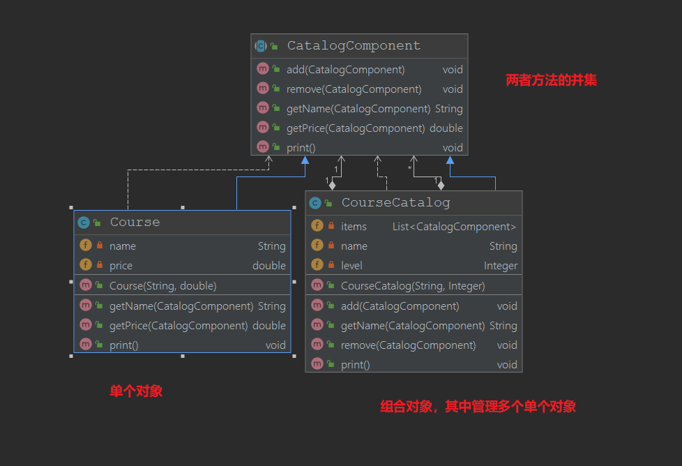

# 组合模式

## 定义
+ 将对象组合成树状结构来完整的表示"部分-整体"之间的关系
    + 部分和整体都采用相同的接口暴露给外面，这也是组合的意思
+ 组合模式使得客户端对单个对象和组合对象保持一致的方式去处理
## 适用场景
+ 忽略组合对象与单个对象之间的差异
+ 处理一个树形的结构
## 优点
+ 可以清楚的定义分层次得到复杂对象，表示对象的全部和部分层次
+ 让客户端忽略层次差异，方便对整个层次结构进行控制
+ 简化客户端代码
+ 符合开闭原则
## 缺点
+ 对单个对象的限制会变得复杂
+ 使得设计变得更加抽象
## UML 类图

## 在源码中的体现
+ AWT中的`Container`继承了`Component`，而显然具体的组件也实现了`Component`方法，在这个关系中`Container`显然是管理树状的子组件的
+ `HashMap`继承并且实现了`Map`接口，而其方法也传入了Map接口的对象，这也体现了组合模式的实现
    + HashMap这个类对应的方法可以处理其他Map类，例如`and`
+ 集合框架很多都是这样
+ 典范：MyBatis的SqlNode对象，MyBatis的XML可以被解析为SqlNode，而其具体的实现有很多，多个SqlNode中有具体单一的SqlNode，也有管理多个SqlNode的`MixedSqlMode`

