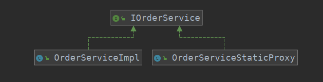

# 代理模式
## 定义
+ 为其他对象提供一种代理，以控制对这个对象的访问
+ 代理对象在客户端与目标对象之间起到中介的作用
## 优点
+ 能够将代理对象与真实被调用的目标对象分离
+ 一定程度上降低了系统的耦合度，扩展性好
+ 可以保护目标对象
+ 对目标对象增强（Spring AOP）
## 缺点
+ 代理模式会再次系统设计中类的数目增加
+ 加入中间层，请求变慢
+ 增加字体的复杂度
## 扩展
+ 静态代理
+ 动态代理
    + JDK动态代理（代理接口,并且只有在程序运行中动态创建的代理类）
    + CGLib动态代理（针对类实现，实现方式是创建一个子类来重写父类的方法，如果是final的就会无法被继承）
## Spring代理选择-扩展
+ 当Spring的Bean有实现接口的时候，Spring就会使用JDK动态代理
+ 当Bean没有实现接口的时候，Spring就会使用CGLib
+ 强制使用CGlib的方法是
```xml
<aop:aspectj-autoproxy proxy-target-class="true"/> 
```
## 代理速度
+ CGLib
    + 使用ASM动态生成字节码（比反射效率高）
+ JDK动态代理

在万次执行测试中，JDK动态代理要比CGLib动态代理快20%左右
## 相关设计模式
+ 装饰者模式
    + 装饰者模式是为对象加上行为
    + 代理模式是控制访问
+ 适配器模式
    + 改变接口的表现
    
## 静态代理案例
针对Order实体，有对应的Dao层`IOrderDao`其对应的实现是`OrderDaoImpl`,Service层`IOrderService`实现类是`OrderServiceImpl`,现在要代理类完成的需求是
实现分库，简单起见，使用Order的id取模，将记录传入到不同的库中，为了实现这样一个功能，可以使用代理，这个代理封装了具体的实现。下面是分库的具体实现
+ 分库必然需要多个数据源，那么需要能决定分到具体数据源的抽象层，其必然维护相关的数据源，这个抽象层就是`AbstractRoutingDataSource`
+ 分库逻辑决定了将数据分配到哪里，如果通过直接传参的方式和数据源耦合过密，所以使用ThreadLocal来作为约定传递
## 静态代理UML


## JDK动态代理的相关内容
+ 首先要想使用JDK动态代理，需要做两件事情：
    1. 代理类实现`InvocationHandler`接口，该接口只有一个`public Object invoke(Object proxy, Method method, Object[] args)`方法
        1. invoke函数的第一个参数是生成的代理类对象（JDK生成），第二个是Method，第三个是方法传入的参数
    1. 使用Proxy 静态方法来获取生成的代理类
## 在源码中的体现
+ Spring中的`JdkDynamicAopProxy`以及`CglibAopProxy`
+ MyBatis 的`MapperRegistry`中的`getMapper（Class<?> clazz）`